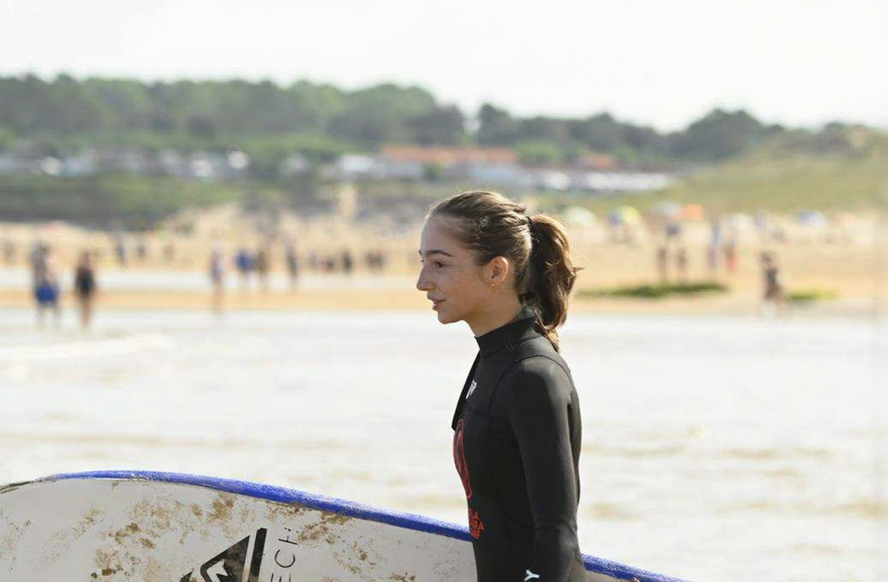

# Pic4Free: Watermark Removal with Identity-Preserving Face Restoration

> HPC pipeline that removes dense semi-transparent watermarks from photographs and restores HD faces with per-person LoRA refinement — every identity claim backed by a measured ArcFace cosine, not by vibes.

[](https://www.python.org/)
[](https://pytorch.org/)
[](https://www.nvidia.com/)
[](https://huggingface.co/black-forest-labs/FLUX.1-dev/blob/main/LICENSE.md)

| Input (watermarked) | Restored (HD, identity-checked) |
|---|---|
|  |  |
|  |  |

*Drop your own before/after pairs at the paths above (`docs/`). The table renders automatically once the four JPGs exist.*

---

## 1. What it does

Given a photo covered by a repeating semi-transparent watermark (text + logos over the whole frame), Pic4Free produces a clean **HD image (1920 px long edge)** that:

1. **Removes the watermark pattern** via instruction-based editing (`FLUX.1-Kontext-dev`), preserving subject, framing and background.
2. **Refines each face individually** with an `img2img` pass of `FLUX.1-dev` conditioned on a **LoRA trained on that exact person** (`P4F_A` / `P4F_B`), composited back with a feathered mask. Faces without an assigned identity get a generic detail pass.
3. **Proves identity preservation**: every output ships a `metrics/task_N_identity.json` with per-face ArcFace cosine similarities against each reference gallery, plus a greedy face↔reference assignment and a pass/warn verdict per face (threshold 0.4).

Two outputs are kept per task: `task_N_restored.png` (post-edit, pre-upscale — a valid result on its own) and `task_N_final.png` (post-refinement HD).

## 2. How it works

```
watermarked (N).jpg ─┐
                     ├─► S0 resolve pair ─► S1 watermark mask (thumb diff) ─► S3 Kontext edit ─► S4 FaceLoRA HD ─► final + metrics
thumb-400 (N).jpg ───┘         │                    ▲                                ▲
                               │                    │                                │
identity_person_A/B ─► S2 biometrics (ArcFace refs, vote, verify) ──────────────────┘
```

### S0 — Input resolution
Each task index resolves a `watermarked (N).jpg` + `thumb-400 (N).jpg` pair from `data/input/`. The clean thumbnail doubles as structural prior and as identity fallback.

### S1 — Watermark masking
The thumbnail (clean) is upscaled to input size and the **positive luminance difference** isolates the whitish overlay (`watermark_diff_threshold: 18.0`, dilated 2 px). It gates execution (below `watermark_min_fraction` the heavy stages are skipped) and is saved as `debug_watermark.png`. Background-erase segmentation (BEN2) exists only behind the `enable_ben_debug` flag for diagnostics — a full silhouette is the wrong inpainting region.

### S2 — Biometrics (audit-grade, not generative)
InsightFace detection + ArcFace-512 embeddings per reference gallery, with a **robust mean** (largest face of the full image; faceless images excluded, never zero-padded). Outputs per face: embedding, norm-based quality probe, and a vote (`select_identity`) mapping the visible face to gallery A/B. A `verify_faces` pass computes the **face×reference cosine matrix** with greedy assignment. Note: the PuLID identity-injection branch is retired but preserved behind `identity.injection` — at full weight it dragged similarity 0.70→0.10, so generation stays identity-free and identity lives in measurement + LoRA.

### S3 — Instruction-based edit
`FluxKontextPipeline` (`FLUX.1-Kontext-dev`) with a fixed edit instruction: remove the repeating watermark, keep person/scene/framing identical, add no text. Deterministic seed; Deep GPU-CPU offload; a single `_flush_memory()` before this VRAM-heavy stage.

### S4 — HD upscaling + per-face LoRA refinement (`FaceLoRAUpscaler`)
1. Global Lanczos upscale to 1920 px long edge.
2. Per assigned face: square crop (×2.0 expand, ≥512 px) → `FluxImg2ImgPipeline` (FLUX.1-dev, strength 0.45, 28 steps) with **that person's LoRA** (`set_adapters`) and trigger prompt → feathered re-composite. Missing LoRA file ⇒ loud warning + generic pass (never silent).
3. Legacy `RestoreFormer++` (ONNX) and SUPIR paths remain behind `face_refine_backend: "restoreformer"` / `enable_upscaling`.

## 3. Identity metric protocol
- **Method**: ArcFace (InsightFace `buffalo_l`) cosine between each detected face of the final image and each gallery mean (computed identically offline in `src/pic4free/utils/verify_offline.py`).
- **Assignment**: greedy max, no repeats. **Threshold**: 0.4 → `OK`, otherwise a `BELOW THRESHOLD` warning (never fails the pipeline).
- **Artifact**: `metrics/task_N_identity.json` with backend, confidences, selection, pre/post assignments.

## 4. Train your own LoRA (per-person, ~1 h on H100)
Identity LoRAs are personal: the repo ships tools, not weights (`weights/*.safetensors` is git-ignored).
1. **Curate**: `sbatch slurm/curate_lora.sh` → face+shoulder square crops + `P4F_X` captions + 2 hardest faces held out (`data/lora/`, `manifest.json`). Audit first with `sbatch slurm/audit_dataset.sh` (blur, size, identity outliers, duplicates).
2. **Train** (diffusers-native DreamBooth, isolated under `src/pic4free/training/`): `sbatch slurm/train_dreambooth.sh B 1000 8 myrun` (person, steps, rank). Checkpoints mirror to shared storage automatically; resume works across nodes/jobs.
3. **Select**: `sbatch slurm/check_lora.sh` — rejects NaN/zero-init weights (a silent failure mode we hit: 43M NaNs from a crashed run) and reports norms; pick by held-out cosine.
4. **Deploy**: copy the winner to `weights/lora_person_{A,B}.safetensors` — the upscaler loads it with a finiteness gate.
- Reference points: rank 8–16, lr 1e-4, bf16, no prior preservation; B (10 photos) overfits past ~1000 steps — watch samples.

## 5. Repository layout
```text
Pic4Free/
├── src/
│   ├── __init__.py
│   └── pic4free/
│       ├── __init__.py
│       ├── core/
│       │   ├── config.py          # structured OmegaConf configuration
│       │   ├── main.py            # module-based CLI entrypoint
│       │   └── pipeline.py        # four-stage orchestrator + metrics
│       ├── models/
│       │   ├── mask_generator.py  # BEN2 debug segmentation
│       │   ├── identity_extractor.py # InsightFace/ArcFace + EVA-CLIP
│       │   ├── flux_inpainter.py  # Kontext / FLUX.1 editing paths
│       │   ├── super_resolution.py # FaceLoRA, RestoreFormer++, SUPIR
│       │   └── pulid_official.py  # isolated PuLID-FLUX adapter
│       ├── utils/
│       │   └── verify_offline.py  # batch identity audit without GPU
│       ├── cli/
│       │   ├── audit_dataset.py   # gallery audit
│       │   ├── curate_lora.py     # face crops, captions, held-out split
│       │   └── check_lora_weights.py # NaN/zero-init checkpoint gate
│       └── training/
│           └── train_dreambooth_lora_flux.py # vendored diffusers trainer
├── slurm/
│   ├── restore_single.sh    # one production task
│   ├── restore_array.sh     # array production sweep
│   ├── curate_lora.sh       # CPU curation job
│   ├── audit_dataset.sh     # CPU identity-gallery audit
│   ├── check_lora.sh        # CPU checkpoint validation
│   └── train_dreambooth.sh  # GPU LoRA training job
├── weights/               # .gitkeep + YOUR safetensors (never committed)
├── docs/                  # header before/after JPGs (tracked)
├── data/                  # NOT tracked: bring your own dataset
│   ├── input/             # watermarked (N).jpg + thumb-400 (N).jpg
│   ├── identity_person_A/B/
│   └── output/run_<JOB_ID>/{restored,metrics,logs}/
├── requirements.txt
└── README.md
```

## 6. Run it
Prerequisites: Linux + Slurm, `devel/python/3.12.3` module (**do NOT load any `devel/cuda` module** — it conflicts with the venv's cuDNN), one H100 (80 GB), and `hf_token.txt` with access to the three gated repos (`FLUX.1-dev`, `FLUX.1-Kontext-dev`, `guozinan/PuLID` if you ever re-enable injection).

```bash
# One image, production settings: TASK BACKEND IDSCALE USE_INPAINT SELECTION
sbatch slurm/restore_single.sh 0 kontext 1.0 true average

# Full dataset (tasks 0-96, 16 concurrent GPUs)
sbatch slurm/restore_array.sh

# Troubleshoot a single identity without the array
sbatch --array=42 slurm/restore_array.sh
```

The application entrypoint is `python -m pic4free.core.main` with `PYTHONPATH=src`, and it takes OmegaConf dotlist args (`task_id=0 job_id=x paths.input_dir=... flux.backend=kontext ...`). The Slurm wrappers set `PYTHONPATH` and invoke the same module entrypoint. First run per node downloads ~45 GB of weights (slow once, then cached).

### Outputs per task
- `restored/task_N_restored.png` — post-edit, pre-upscale (first-class result).
- `restored/task_N_final.png` — HD + per-face refinement.
- `restored/task_N_debug_watermark.png` (+ `debug_mask.png` only with BEN debug on).
- `metrics/task_N_identity.json` — backend, confidences, selection, injected identity, pre/post face assignments with cosines.
- `logs/` — Slurm log copies.

## 7. Configuration reference
All fields live in `src/pic4free/core/config.py` (OmegaConf-mergeable from CLI as `section.field=value`):

| Key | Type | Default | What it does |
|---|---|---|---|
| `task_id` / `job_id` | str | `"0"` / `"manual"` | Task index + run tag (output folder `run_<job_id>`) |
| `paths.input_dir` | str | `data/input` | `watermarked (N).jpg` + `thumb-400 (N).jpg` pairs |
| `paths.identity_a_dir` / `identity_b_dir` | str | `data/identity_person_A/B` | Reference galleries (also LoRA training source) |
| `paths.output_dir` | str | `data/output/run_default` | Overridden per Slurm job |
| `masking.model_id` | str | `PramaLLC/BEN2` | Debug-only segmenter (see `enable_ben_debug`) |
| `masking.ssim_threshold` | float | 0.65 | Legacy gate, currently unused |
| `masking.enable_ben_debug` | bool | false | Download+run BEN for `debug_mask.png` only |
| `masking.watermark_diff_threshold` | float | 18.0 | Positive-luminance delta (0–255) vs thumbnail |
| `masking.watermark_dilate_px` | int | 2 | Dilation of the watermark mask (7px merged dense patterns) |
| `masking.watermark_min_fraction` | float | 0.0005 | Below this, heavy stages are skipped |
| `identity.model_name` | str | `adaface_ir101` | Historical name (backbone is InsightFace/EVA-CLIP) |
| `identity.margin_adaptation` | bool | true | Norm-as-quality confidence path on/off |
| `identity.confidence_divisor` | float | 35.0 | Raw ArcFace norm → [0,1] quality probe |
| `identity.match_threshold` | float | 0.4 | Cosine gate: warn-only, never fails the task |
| `identity.selection` | str | `average` | `average`/`auto` (thumb vote)/`A`/`B` identity for injection |
| `identity.injection` | str | `none` | `pulid` reactivates dormant injection (needs full biometrics) |
| `identity.metric_only` | bool | true | Skip EVA+IDFormer (~4 min/task); ArcFace-only audit |
| `flux.model_id` | str | `black-forest-labs/FLUX.1-dev` | Base for img2img refinement |
| `flux.backend` | str | `kontext` | Production instruction-based editing path; `flux` is the legacy diagnostic path |
| `flux.kontext_model_id` | str | `black-forest-labs/FLUX.1-Kontext-dev` | Instruction-based editor |
| `flux.edit_instruction` | str | (see config) | Watermark-removal instruction, framing-preserving |
| `flux.num_inference_steps` | int | 35 | Denoising steps (Kontext path) |
| `flux.guidance_scale` | float | 3.5 | 2.5 auto-selected for kontext by the `.sh` |
| `flux.seed` | int | 42 | Deterministic generation |
| `flux.prompt` | str | (see config) | Legacy T2I prompt (retired flux path) |
| `flux.id_scale` / `dropout_p` | float | 1.0 / 0.0 | Dormant PuLID knobs (kept parametric) |
| `flux.pulid_model_id` / `pulid_ckpt_file` | str | `guozinan/PuLID` / `pulid_flux_v0.9.1.safetensors` | Dormant (the repo has no `pulid_flux.safetensors`) |
| `flux.use_inpaint_pipeline` | bool | true | Legacy latent-blend flag (retired: caused rainbow collapse) |
| `flux.hf_token_file` | str | `hf_token.txt` | Token fallback chain: arg > env > file |
| `superres.model_id` / `scale_factor` | str/int | `SUPIR` / 2 | Legacy SUPIR path (disabled) |
| `superres.face_fidelity_weight` | float | 0.85 | Legacy, currently unused |
| `superres.enable_face_refinement` | bool | true | Master switch for Stage 4 |
| `superres.enable_upscaling` | bool | false | SUPIR global upscale (off: costly, unvalidated) |
| `superres.target_long_edge` | int | 1920 | HD output size (not 4K by design) |
| `superres.face_refine_backend` | str | `lora` | `lora` per-face img2img, or `restoreformer` legacy |
| `superres.flux_model_id` | str | `black-forest-labs/FLUX.1-dev` | img2img base for refinement |
| `superres.lora_a_path` / `lora_b_path` | str | `weights/lora_person_{A,B}.safetensors` | Missing file ⇒ loud warning + generic pass |
| `superres.lora_trigger_a` / `lora_trigger_b` | str | `P4F_A` / `P4F_B` | Must match training triggers |
| `superres.lora_strength` | float | 0.45 | Recorded decision: no global tuning on 1–2 tasks (optimum is per-image); adaptive scheme parked |
| `superres.lora_guidance` / `lora_steps` | float/int | 3.5 / 28 | Per-face refinement sampling |
| `superres.lora_crop_expand` / `lora_feather_px` / `lora_min_crop` | float/int/int | 2.0 / 24 / 512 | Crop geometry + feathered re-composite |
| `superres.refine_unassigned` | bool | true | Unassigned faces get the generic pass |

## 8. Known limitations (read before trusting outputs)
- **LoRA data hunger**: B (10 photos) underperforms A; rank 8 + ≤1000 steps is the ceiling without overfitting. More diverse photos beat more steps.
- **Generic refinement drifts identity** (0.51→0.30 cosine): always train the LoRA; the generic fallback is a validator, not a product path.
- **Profile faces**: both ArcFace matching and LoRA transfer degrade off-frontal; thresholds assume near-frontal.
- **Per-node scratch**: checkpoints/train artifacts live on compute-node scratch — every producer job copies finals to shared storage (`weights/`, `data/lora/dblora_*`). Never assume cross-node visibility.
- **Transient Xids**: two `illegal memory access` crashes on different nodes traced to infra (bitsandbytes×Hopper for one, unknown-transient for the other); everything resumes from shared checkpoints, and LoRAs are finiteness-gated on load.
- **Threshold 0.4** is calibrated on 2 subjects — re-tune it if your cast grows.

## 9. License & responsible use
- Model weights follow their own licenses, notably the **FLUX.1-dev Non-Commercial License** (research/personal use). LoRAs you train inherit these terms.
- This repository exists to restore photographs, not to fabricate identities: do not use it on people without consent, and do not present restored faces as evidentiary material. The cosine gate is a quality signal, not a biometric verdict.

## 10. Tooling map (where to look next)
- New identity to enroll → `audit_dataset.sh` → `curate_lora.sh` → `train_dreambooth.sh` → `check_lora.sh` → drop into `weights/` → production `restore_array.sh`.
- Suspect a run → `restored/` PNGs → `metrics/*_identity.json` → Slurm log (`_flush_memory`, `[METRIC]`, `[FaceLoRA]`, `[SELECTION]` markers).
- Reproduce anything → fixed `seed: 42` + logged effective config per run.
