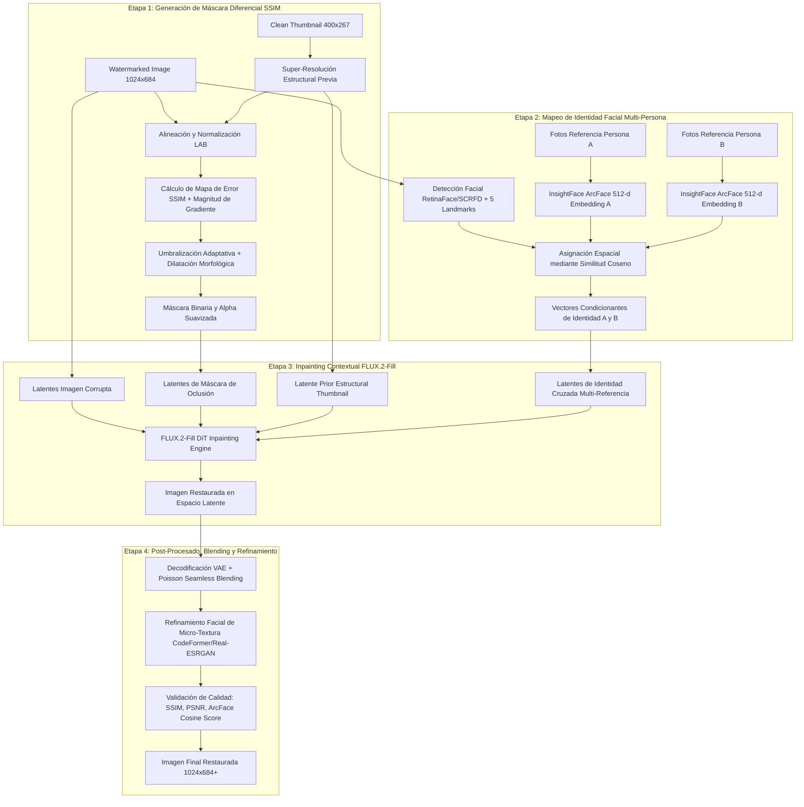

# SurfAI: Multi-Person Watermark Restoration & Facial Identity Inpainting Pipeline
### *High-Performance Computing (HPC) Industrial Architecture — State of the Art (August 2026)*

[](https://www.python.org/)
[](https://pytorch.org/)
[-purple.svg)](https://huggingface.co/)
[](https://github.com/deepinsight/insightface)
[](https://slurm.schedmd.com/)

---

## 1. Visión General y Propósito del Repositorio

**SurfAI** es una infraestructura computacional de nivel industrial y de alto rendimiento (HPC) diseñada para la **restauración automatizada y de ultra-alta fidelidad de fotografías de alta resolución degradadas por marcas de agua densas, semitransparentes u opacas**, con un enfoque primordial en la **preservación y reconstrucción de la identidad facial multi-persona**.

### El Problema Crítico
El dataset objetivo comprende una colección de ~100 fotografías profesionales y personales de alto valor sentimental donde aparecen **hasta dos personas distintas de forma simultánea** (Sujeto A y Sujeto B). Las imágenes sufren de marcas de agua complejas y dispersas que ocluyen rasgos faciales, expresiones y fondos texturizados. 

Sin embargo, el sistema cuenta con dos ventajas clave:
1. **Miniaturas Limpias de Referencia (`thumb-400`):** Imágenes de baja resolución (400×267 px) no corrompidas que funcionan como un *mapa estructural a priori* (colorimetría, luminancia, geometría global y fondo).
2. **Bancos de Identidad Multi-Referencia (`identity_person_A` y `identity_person_B`):** Galerías de retratos nítidos y sin oclusiones de cada sujeto que permiten computar hipervectores de identidad facial invariantes.

### Ecosistema Tecnológico (Agosto 2026)
SurfAI integra los últimos avances en modelos de difusión por Flow Matching y reconocimiento biométrico:
* **FLUX 2 / FLUX.2-Fill (12B Diffusion Transformer):** Backbone de inpainting contextual condicionado por gradiente, ruido estructural y texto/identidad.
* **InsightFace (AntelopeV2 / Buffalo_l ArcFace 512-d):** Extracción de embeddings faciales y enrutamiento espacial multi-sujeto mediante similitud coseno.
* **Máscaras Diferenciales Multiescala (SSIM + Gradiente):** Segmentación matemática precisa de las regiones afectadas sin tocar regiones vírgenes.
* **Orquestación Paralela Masiva con Slurm:** Despacho distribuido mediante **Slurm Array Jobs** con escalabilidad lineal en clústeres GPU (NVIDIA H100 / A100).

---

## 2. Arquitectura del Pipeline y Fundamento Matemático

El pipeline de restauración de SurfAI opera en **cuatro etapas secuenciales desacopladas y deterministas**:



---

### Descripción Detallada de las Etapas

#### Etapa 1: Generación de Máscara Diferencial mediante SSIM y Análisis Multiescala
1. **Alineación Geométrica y Cromática:** El thumbnail limpio $I_{\text{thumb}} \in \mathbb{R}^{267 \times 400 \times 3}$ se escala al tamaño de la imagen con marca de agua $I_{\text{wm}} \in \mathbb{R}^{684 \times 1024 \times 3}$ mediante interpolación Lanczos4. Se aplica una transferencia de color y luminancia en el espacio CIELAB para compensar diferencias de compresión JPEG.
2. **Mapa de Disimilitud Estructural (DSSIM):** Se evalúa la métrica SSIM local con ventana gaussiana ($\sigma = 1.5$):
   $$\text{DSSIM}(x, y) = \frac{1 - \text{SSIM}(I_{\text{wm}}(x,y), I_{\text{thumb}}(x,y))}{2}$$
3. **Análisis de Gradiente de Alta Frecuencia:** Las marcas de agua introducen bordes afilados inexistentes en el thumbnail. Se computa la diferencia de norma de gradiente:
   $$\Delta \nabla I = |\nabla I_{\text{wm}}| - |\nabla I_{\text{thumb}}|$$
4. **Fusión y Morfología Matemática:** Se combinan DSSIM y $\Delta \nabla I$, aplicando un umbral adaptativo de Otsu seguido de una operación de cierre morfológico y dilatación elíptica ($k = 7\times 7$, 2 iteraciones) y suavizado gaussiano de borde ($\sigma = 2.0$) para evitar artefactos en la frontera del inpainting.

#### Etapa 2: Mapeo y Enrutamiento de Identidad Multi-Persona (InsightFace)
1. **Bancos de Características de Identidad:** A partir de las imágenes de `/data/identity_person_A/` y `/data/identity_person_B/`, se extraen los vectores normalizados de características faciales $v_A, v_B \in \mathbb{R}^{512}$ utilizando el modelo SOTA ArcFace (backbone IResNet-100 / AntelopeV2):
   $$\bar{v}_A = \frac{1}{N_A} \sum_{i=1}^{N_A} \frac{\phi(I_{A, i})}{\|\phi(I_{A, i})\|_2}, \quad \hat{v}_A = \frac{\bar{v}_A}{\|\bar{v}_A\|_2}$$
2. **Detección y Asociación Espacial:** En la imagen de entrada (y su miniatura), se detectan las caras $F_1, F_2, \dots, F_k$ mediante RetinaFace/SCRFD y se extraen sus embeddings $\phi(F_j)$.
3. **Enrutamiento por Similitud Coseno:**
   $$S_C(\phi(F_j), \hat{v}_p) = \phi(F_j) \cdot \hat{v}_p \quad (p \in \{A, B\})$$
   Si $S_C \ge \tau_{\text{match}}$ (típicamente 0.55), la región facial $j$ queda asociada a la identidad correspondiente, construyendo el mapa de atención cruzada e inyección de tokens de identidad.

#### Etapa 3: Inpainting Contextual con FLUX 2 (FLUX.2-Fill)
1. **Arquitectura Flow Matching DiT (12B Parámetros):** FLUX.2-Fill opera directamente sobre el espacio latente del VAE, procesando conjuntamente la imagen enmascarada, la máscara binaria, la estructura previa del thumbnail y los condicionantes de identidad.
2. **Condicionamiento Multi-Modal:**
   * **Canal Estructural:** Proporciona coherencia geométrica global y distribuciones de color procedentes de la miniatura limpia.
   * **Canal de Identidad Cruzada:** Modula los bloques de atención cruzada (*Cross-Attention Layers*) en las coordenadas espaciales donde se detectó a cada persona, asegurando que la reconstrucción de ojos, nariz, boca y estructura ósea coincida exactamente con la biometría de referencia.
3. **Muestreador de Flujo Rectificado:** Inferencia acelerada con 28 pasos y escala de guía (CFG) de 3.5 para máxima fidelidad fotográfica y nulo sobre-saturado.

#### Etapa 4: Post-Procesado, Seamless Blending y Refinamiento Facial
1. **Poisson Seamless Blending:** Integración de la región restaurada en el fondo intacto original, resolviendo la ecuación de Poisson con condiciones de frontera de Dirichlet para eliminar discontinuidades de luminancia.
2. **Refinamiento Facial de Micro-Textura (CodeFormer / Real-ESRGAN):** Restauración de detalles de alta frecuencia (poros de la piel, pestañas, iris) con un parámetro de fidelidad $\omega = 0.85$ para preservar la identidad sin generar rostros artificiales o "plásticos".
3. **Métricas Automatizadas de Calidad:** Cálculo de PSNR, SSIM, LPIPS y puntuación de verificación biométrica de identidad facial antes de almacenar los resultados.

---

## 3. Estructura del Repositorio

```text
SurfAI/
├── .venv/                         # Entorno virtual de Python (creado dinámicamente)
├── .cache/                        # Cache local compartida en clúster (HuggingFace, Torch, InsightFace)
├── data/
│   ├── identity_person_A/         # Galería de imágenes de referencia del Sujeto A (8 fotos)
│   ├── identity_person_B/         # Galería de imágenes de referencia del Sujeto B (9 fotos)
│   ├── input/                     # 98 pares: watermarked (i).jpg y thumb-400 (i).jpg
│   └── output/
│       └── run_<JOB_ID>/          # Directorio generado por cada ejecución de Slurm
│           ├── restored/          # Imágenes finales restauradas a máxima resolución
│           ├── masks/             # Máscaras generadas por el módulo SSIM diferencial
│           ├── intermediates/     # Salidas intermedias de inpainting y alineación facial
│           ├── metrics/           # Reportes JSON/CSV con métricas (SSIM, PSNR, Cosine ID)
│           └── logs/              # Logs de ejecución por tarea Slurm
├── examples/                      # Plantillas base del entorno HPC
│   ├── requirements.txt
│   └── run_typicality.sh
├── slurm/                         # Scripts de ejecución por lotes Slurm
│   ├── restore_array.sh           # Script principal: Slurm Array Job distribuido (0-97)
│   ├── restore_single.sh          # Script de depuración / ejecución de imagen individual
│   └── setup_env.sh               # Aprovisionamiento e instalación en nodo de cómputo
├── src/                           # Código fuente del pipeline en Python
│   ├── __init__.py
│   ├── main.py                    # Entrypoint CLI compatible con Slurm Task IDs
│   ├── config.py                  # Parámetros por defecto, rutas y dataclasses
│   ├── masking.py                 # Algoritmo de máscara diferencial SSIM + Gradiente
│   ├── identity.py                # Módulo InsightFace, extracción de embeddings y matching
│   ├── inpainting.py              # FLUX.2-Fill Pipeline & Flow Matching Inpainting
│   ├── postprocess.py             # Poisson Blending, CodeFormer / Super-Resolución
│   └── utils.py                   # I/O, matching de pares de archivos y métricas
├── requirements.txt               # Dependencias de producción para Python 3.12 + CUDA 12.8
└── README.md                      # Documentación industrial del proyecto
```

---

## 4. Guía de Despliegue en el Clúster HPC

### Prerrequisitos del Sistema
* Sistema Operativo: Linux (RHEL 8/9, Rocky Linux, Ubuntu Server 22.04/24.04 LTS).
* Gestor de Carga de Trabajo: Slurm Workload Manager.
* Módulos de Clúster requeridos:
  * `devel/cuda/12.8` (o CUDA 12.x compatible)
  * `devel/python/3.12.3-gnu-14.2` (o Python 3.11/3.12)
* Hardware Recomendado por Nodo: GPU NVIDIA H100 (80GB SXM5/PCIe) o A100 (80GB), 8 cpus-per-task, 80GB RAM.

---

### Paso 1: Conexión al Clúster y Carga de Módulos
Inicia sesión en el nodo de login del clúster y navega a la raíz del repositorio:

```bash
cd /home/tu/tu_tu/tu_zxoxe46/SurfAI

# Carga explícita de los módulos oficiales del clúster
module purge
module load devel/cuda/12.8
module load devel/python/3.12.3-gnu-14.2

# Verificar versiones cargadas
python3 --version     # Python 3.12.3
nvcc --version        # Cuda compilation tools, release 12.8
```

---

### Paso 2: Creación del Entorno Virtual e Instalación de Dependencias
Crea el entorno virtual `.venv` e instala las dependencias optimizadas de `requirements.txt`:

```bash
# 1. Crear el entorno virtual en la raíz del proyecto
python3 -m venv .venv

# 2. Activar el entorno
source .venv/bin/activate

# 3. Actualizar herramientas de empaquetado
pip install --upgrade pip setuptools wheel

# 4. Instalar dependencias del proyecto
pip install -r requirements.txt
```

---

### Paso 3: Verificación de CUDA y Acceso a GPU
Verifica que PyTorch reconozca correctamente el acelerador CUDA y las extensiones necesarias:

```bash
python3 -c "
import torch
print('PyTorch Version:   ', torch.__version__)
print('CUDA Available:    ', torch.cuda.is_available())
print('CUDA Version:      ', torch.version.cuda)
if torch.cuda.is_available():
    print('Device Name:       ', torch.cuda.get_device_name(0))
    print('Device Capability: ', torch.cuda.get_device_capability(0))
"
```

*(Opcional)* Puedes lanzar el script de aprovisionamiento en un nodo de cómputo GPU mediante Slurm:
```bash
sbatch slurm/setup_env.sh
```

---

## 5. Instrucciones de Ejecución con Slurm

SurfAI está diseñado desde el primer principio para el **procesamiento masivo y desacoplado mediante Slurm Job Arrays**. En lugar de iterar secuencialmente sobre las 98 imágenes en un único script monolítico, el dataset se indexa de forma unívoca y cada tarea del array procesa un único par de imágenes en paralelo sobre la flota de GPUs.

### Mapeo de Identificadores de Tarea (`$SLURM_ARRAY_TASK_ID`)
El dataset en `/data/input/` contiene 98 pares estructurados:
* `watermarked.jpg` $\leftrightarrow$ `thumb-400.jpg` (Mapeado a Índice `0`)
* `watermarked (0).jpg` $\leftrightarrow$ `thumb-400 (0).jpg` (Mapeado a Índice `1`)
* $\dots$
* `watermarked (96).jpg` $\leftrightarrow$ `thumb-400 (96).jpg` (Mapeado a Índice `97`)

El runner en Python (`src/main.py`) recibe `--task_id ${SLURM_ARRAY_TASK_ID}` y resuelve automáticamente el par correspondiente de forma robusta e independiente.

---

### 5.1 Ejecución Completa en Ráfaga (Slurm Array Job)
Para procesar las 98 imágenes simultáneamente en el clúster (con un límite de concurrencia de hasta 16 GPUs simultáneas para respetar las políticas de cuota):

```bash
sbatch slurm/restore_array.sh
```

#### Parámetros Principales de `slurm/restore_array.sh`:
```bash
#SBATCH --job-name=surfai_array
#SBATCH --output=slurm_logs/slurm_%A_%a.out
#SBATCH --error=slurm_logs/slurm_%A_%a.err
#SBATCH --partition=gpu_h100_short
#SBATCH --nodes=1
#SBATCH --ntasks=1
#SBATCH --cpus-per-task=8
#SBATCH --mem=80GB
#SBATCH --gres=gpu:1
#SBATCH --time=0:30:00
#SBATCH --array=0-97%16
```

> **Nota:** `%A` representa el ID maestro del Job Array y `%a` representa el número de tarea individual (`$SLURM_ARRAY_TASK_ID`).

---

### 5.2 Ejecución de un Subconjunto o Imagen Individual
Para depuración, optimización de hiperparámetros o procesar solo una porción del dataset:

* **Procesar una sola imagen mediante Slurm Array:**
  ```bash
  # Ejecuta únicamente la tarea 0 (watermarked.jpg)
  sbatch --array=0 slurm/restore_array.sh

  # Ejecuta únicamente la imagen con índice 42
  sbatch --array=42 slurm/restore_array.sh
  ```

* **Procesar un rango específico (ej. las primeras 10 imágenes):**
  ```bash
  sbatch --array=0-9%4 slurm/restore_array.sh
  ```

* **Ejecutar el script individual de depuración interactiva:**
  ```bash
  # Pasa el task_id como argumento directo
  sbatch slurm/restore_single.sh 0
  ```

---

### 5.3 Ejecución Local / Sesión Interactiva (`salloc`)
Si dispones de una sesión interactiva en un nodo GPU (`salloc --partition=gpu_h100_short --gres=gpu:1 --mem=80GB --cpus-per-task=8 --time=01:00:00`):

```bash
source .venv/bin/activate

# Restaurar la imagen índice 5 con configuración estándar
python3 src/main.py \
    --task_id 5 \
    --job_id manual_test \
    --input_dir data/input \
    --identity_a_dir data/identity_person_A \
    --identity_b_dir data/identity_person_B \
    --output_dir data/output/run_manual_test \
    --num_inference_steps 28 \
    --guidance_scale 3.5 \
    --ssim_threshold 0.65 \
    --enable_face_refinement
```

---

## 6. Monitorización, Telemetría y Resultados

### Comandos Útiles de Monitorización en Slurm

```bash
# Ver estado de todas las tareas activas de tu usuario
squeue -u $USER

# Ver resumen de estado y consumo de recursos de un Job Array
sacct -j <JOB_ID> --format=JobID,JobName,Partition,AllocCPUS,State,ExitCode,Elapsed,MaxRSS

# Cancelar todas las tareas de un array en ejecución
scancel <JOB_ID>

# Ver log en tiempo real de una tarea específica
tail -f slurm_logs/slurm_<JOB_ID>_<TASK_ID>.out
```

### Estructura de Salida por Job ID
Cada ejecución crea automáticamente un subdirectorio aislado en `/data/output/run_<JOB_ID>/`:

* `restored/`: Contiene `watermarked (i)_restored.png` a resolución completa con colorimetría corregida y rostros preservados.
* `masks/`: Contiene `watermarked (i)_mask.png` (máscara binaria) y `watermarked (i)_diff.png` (mapa de disimilitud SSIM).
* `intermediates/`: Contiene cultivos faciales alineados, mapas de atención y latentes previos.
* `metrics/`: Contiene `metrics_task_<TASK_ID>.json` con métricas de similitud facial, SSIM residual y tiempos de inferencia.
* `logs/`: Contiene copia sincronizada de los ficheros `.out` y `.err` generados por Slurm.

---

## 7. Tabla de Hiperparámetros de Configuración

| Parámetro | Tipo | Valor por Defecto | Descripción |
| :--- | :---: | :---: | :--- |
| `--task_id` | `int` | `0` | Índice unívoco de la imagen dentro del dataset (0 a 97). |
| `--job_id` | `str` | `manual` | Identificador del trabajo Slurm para estructurar la carpeta de salida. |
| `--num_inference_steps` | `int` | `28` | Número de pasos del muestreador Flow Matching de FLUX.2-Fill. |
| `--guidance_scale` | `float` | `3.5` | Escala de Classifier-Free Guidance (CFG). |
| `--ssim_threshold` | `float` | `0.65` | Umbral mínimo de disimilitud para considerar un píxel como marca de agua. |
| `--face_fidelity_weight` | `float` | `0.85` | Ponderación de fidelidad biométrica en el refinamiento facial de CodeFormer. |
| `--enable_face_refinement` | `bool` | `True` | Activa la etapa de mejora de micro-textura facial post-inpainting. |
| `--dilation_kernel_size` | `int` | `7` | Tamaño del kernel morfológico para englobar bordes difusos de la marca de agua. |

---

## 8. Licencia y Buenas Prácticas de Investigación
Este repositorio ha sido desarrollado para proyectos de preservación y restauración fotográfica de alta fidelidad en entornos de supercomputación. Queda estrictamente prohibido el uso no ético o la manipulación no autorizada de identidades biométricas.
